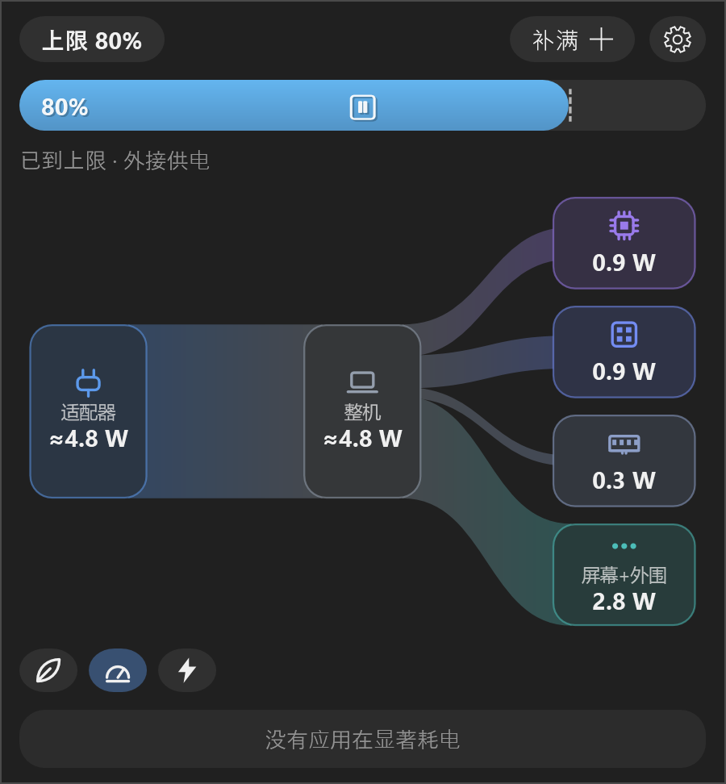

<p align="center">
  
</p>
<h1 align="center">ClearPower</h1>
<p align="center">
  <strong>Battery charge limit and an honest, live power-flow view for laptops.</strong><br>
  Linux · macOS · Windows &nbsp;—&nbsp; the same popover on all three.
</p>
<p align="center">
  <a href="https://github.com/Clearailhc/ClearPower/releases/latest"></a>
  <a href="https://github.com/Clearailhc/ClearPower/actions/workflows/build.yml"></a>
  <a href="LICENSE"></a>
  
</p>
<p align="center">
  <b>English</b> · <a href="README.zh-CN.md">简体中文</a>
</p>

<p align="center">
  &nbsp;&nbsp;
  
</p>

ClearPower keeps your battery at 80 % (or whatever you choose) and shows where every watt goes — adapter or battery → system → CPU · GPU · SoC · memory · display · other — with numbers that are either **measured or derived by subtraction**, so the parts always add up to the whole. Inspired by [AlDente](https://apphousekitchen.com/) on macOS, built for laptops that spend their life on a desk.

## Features

- **Charge limit** — click to cycle 80 / 90 / 100 %, or any value 50–100 in settings. **Top Up** to 100 % once; **Discharge** to the limit (where the firmware allows); both revert automatically.
- **Power flow that adds up** — a live Sankey diagram from real sensors: Intel RAPL / Apple's energy counters for the chip, the battery's own gauge for the whole machine. Nothing is modelled.
- **Real display power** — a one-time calibration (white screen + brightness sweep) gives your panel its own curve, scaled by the live screen content. On OLED a white page can cost 7 W and a dark desktop 0.4 W; ClearPower shows it.
- **Runtime estimate** from the battery's energy counter over a 10 min / 30 min / 1 h window, steadier than the OS guess.
- **Power modes, temperatures, fans and the apps using significant energy**, in the same popover.
- **Light** — one small process, sampling slows down when nobody is looking, the diagram animates only while open.
- English and Chinese UI, light and dark themes.

## Install

| Platform | Get it | Notes |
|---|---|---|
| **Windows 11** (x64) | [`ClearPower-Setup-<v>-x64.exe`](https://github.com/Clearailhc/ClearPower/releases/latest) or the portable zip | Per-user install, no admin, no runtime to download (a single 200 KB exe). Charge control on ThinkPads via the Lenovo driver. → [windows/README.md](windows/README.md) |
| **macOS** (Apple Silicon) | [`ClearPower-<v>-arm64.dmg`](https://github.com/Clearailhc/ClearPower/releases/latest) | macOS 14+. A small privileged helper (one admin prompt) owns charge control. → [macos/README.md](macos/README.md) |
| **Linux** (GNOME 48–50) | [`clearpower_<v>_all.deb`](https://github.com/Clearailhc/ClearPower/releases/latest) or `./install.sh` | Root daemon + GNOME Shell extension. → [docs/linux.md](docs/linux.md) |

After installing, open **Settings › Calibrate** once so the display gets its own number instead of being lumped into "other" (Windows: unplug first — the battery is the whole-machine sensor there).

Every release ships all three packages together, with a `SHA256SUMS` file.

## How the numbers are made

| Quantity | Linux | macOS | Windows |
|---|---|---|---|
| Whole machine | battery gauge on battery, RAPL `psys` on AC | battery gauge on battery, SMC `PSTR` on AC | battery gauge on battery; on AC an estimate (≈) |
| CPU / GPU / memory | RAPL `core` / `uncore` / `dram` | IOReport `CPU Energy` / `GPU Energy` / `DRAM` | Energy Meter `PP0` / `PP1` / `DRAM` |
| SoC (fabric, NPU, media…) | `package` − CPU − GPU | everything else on the die | `PKG` − PP0 − PP1 |
| Display | calibration table × brightness × screen content | same | same |
| Other (SSD, Wi-Fi, USB…) | total − everything above | same | same |
| Charge thresholds | `charge_control_*_threshold` (sysfs) | SMC keys, enforced by the helper | Lenovo Power Manager (EC) |

All watt values pass a 5 s smoother before display. Per-platform details and hardware support tables live in the platform READMEs.

## Hardware support at a glance

| | Full breakdown | Charge limit | Discharge |
|---|---|---|---|
| Linux | Intel RAPL | ThinkPad and other vendors with the kernel threshold interface | ThinkPad |
| macOS | Apple Silicon | all Apple Silicon Macs | yes |
| Windows | Intel (Windows 11 Energy Meter Interface) | ThinkPad (Lenovo Power Manager driver) | – |

Contributions for AMD RAPL, other vendors' charge interfaces and Windows sensor drivers are very welcome — see [Contributing](#contributing).

## Repository layout

```
daemon/          Linux backend (Python): the reference implementation of the Snapshot contract
extension/       GNOME Shell frontend
macos/           Swift package: core logic, IOKit/SMC backend, privileged helper, SwiftUI app
windows/         C#/WPF: core logic, Energy Meter / battery / Lenovo backend, tray app, installer
docs/            per-platform notes, release notes, screenshots
packaging/       systemd unit, D-Bus policy, polkit action, desktop entries, deb scripts
```

Every port produces the same `Snapshot` dictionary (same keys, same units, `-1` = unknown) and is checked against the Python daemon with golden tests (`macos/scripts/gen-fixtures.py`, fixtures shared by the Swift and C# ports). A new platform only needs a backend that fills that dictionary.

## Contributing

Issues and pull requests are welcome: RAPL on AMD, charge-threshold interfaces of other vendors (Linux and Windows), translations (one dictionary per platform, same keys), and frontends for other desktops. Two rules shape the project:

1. every number shown is measured or derived from measurements — no models, no guesses without a ≈;
2. nothing runs when nobody is looking.

Roadmap: Windows charge control beyond Lenovo and a signed sensor driver for temperatures; macOS notarization and SMAppService; AMD RAPL on Linux.

## License

[Apache-2.0](LICENSE)
