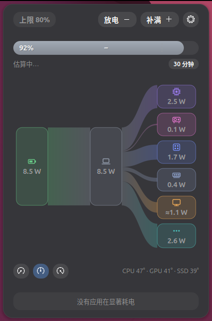

<p align="center">
  
</p>
<h1 align="center">ClearPower</h1>
<p align="center">
  Battery charge control and an honest, live power-flow view for Linux laptops.<br>
  <em>Inspired by AlDente on macOS. GNOME Shell 48–50.</em>
</p>
<p align="center">
  <a href="https://github.com/Clearailhc/ClearPower/releases">Releases</a> ·
  <a href="#install">Install</a> ·
  <a href="#how-the-numbers-are-made">How it works</a> ·
  <a href="#development">Development</a>
</p>

<p align="center"></p>

## Features

- **Charge limit** — click to cycle 80 / 90 / 100 %. **Top Up** to 100 % once, **Discharge** to the limit; both revert automatically.
- **Power flow that adds up** — adapter/battery → system → CPU · GPU · SoC · memory · display · other. Every number is measured or derived by subtraction, so the parts always equal the whole. Sinks under 0.1 W are hidden.
- **Runtime estimate** from the battery's own energy counter over a 10 min / 30 min / 1 h window — steadier than the instantaneous system estimate.
- **Real display power** — calibrated on your panel (white screen + brightness sweep), then scaled by the live on-screen brightness. Essential on OLED, where a white page can cost 7 W and a dark desktop 0.4 W.
- **Power profiles**, temperatures, fans and the apps using significant energy, in the same popover.
- **Light** — one small root daemon (~30 MB, well under 1 % of a core), sampling slows down when nobody is looking; the popover animates only while open and respects "reduce animations".
- English and Chinese UI, switchable in settings.

## Install

**Debian / Ubuntu** — download the `.deb` from [Releases](https://github.com/Clearailhc/ClearPower/releases) and:

```bash
sudo apt install ./clearpower_*_all.deb
```

Log out and back in once. The top-bar indicator is enabled automatically at login; **ClearPower** in the app grid (or `clearpower` in a terminal) opens the settings, `clearpower status` shows daemon and extension state.

Then open the settings and press **Calibrate** once (about 45 s, the screen turns white and sweeps brightness) so the display gets its own number instead of being lumped into "other".

**From source**

```bash
git clone https://github.com/Clearailhc/ClearPower.git && cd ClearPower
./install.sh          # builds the .deb with dpkg-deb and installs it
```

Requirements: GNOME Shell 48+, `python3`, `python3-gi`, `python3-psutil`, systemd, polkit. Fully featured on Intel laptops with RAPL and a ThinkPad-style battery interface; see [Hardware support](#hardware-support).

Remove with `sudo apt remove clearpower` (`purge` also deletes the state in `/var/lib/clearpower`).

## How the numbers are made

| Quantity | Source |
|---|---|
| System total | Battery `power_now` when discharging (physical truth), otherwise Intel RAPL `psys` |
| CPU / GPU / memory | RAPL `core`, `uncore`, `dram` |
| SoC | RAPL `package` − core − uncore (fabric, NPU, media) |
| Display | Calibration table × live screen luminance (see below); shown as ≈ |
| Other | Total − everything above (SSD, Wi-Fi, USB, panel electronics — no sensors exist) |
| Adapter | Total + battery charge power; negotiated PD wattage from `ucsi` |

All watt values pass through a 5 s exponential smoother before display; history and the runtime estimate use raw values.

**Display calibration.** Laptops have no panel power sensor, but brightness is a knob we control and platform power is measured. The daemon sets brightness to 0, 1, 10, 25, 50, 75 and 100 % while the extension shows a white screen and records the median of *psys − package − dram* at each step. The resulting table is the panel's emission at content level 1.0; at runtime it is scaled by the average linear luminance of a ~50×30 px re-render of the screen, sampled every 5 s while the popover is open (only the mean leaves the function; nothing is stored). Turn off "content-aware estimate" in settings if you prefer brightness-only.

**Charge control.** Limit L writes `charge_control_end_threshold = L`, `start = L − 5`. Top Up temporarily raises the thresholds to 95/100 until Full. Discharge sets `charge_behaviour = force-discharge` until the level reaches the limit (never below 20 %). Special modes never survive a daemon restart; SIGTERM restores `auto`.

**Runtime.** Over the chosen window, the oldest sample in the current uninterrupted discharge segment gives `avg_W = ΔE/Δt`; remaining time = `energy_now / avg_W`. While charging, the same gives the time to reach the limit. A leading `~` means fewer than 5 min of data.

## Hardware support

| Capability | Needs | Fallback |
|---|---|---|
| Charge limit / Top Up | `charge_control_{start,end}_threshold` (ThinkPad, many ASUS/LG/Huawei…) | Controls hidden |
| Discharge | `charge_behaviour` with `force-discharge` (ThinkPad) | Button hidden |
| Breakdown | Intel RAPL (`/sys/class/powercap/intel-rapl:*`) | Single "system" node |
| Display calibration | RAPL `psys` + `/sys/class/backlight` | Display folded into "other" |
| Power profiles | `power-profiles-daemon` | Buttons hidden |

Tested on a ThinkPad X14 Gen 1 (Core Ultra, Samsung OLED) with Ubuntu 26.04. AMD RAPL and other vendors' charge interfaces are welcome contributions.

## Configuration

Extension settings (top-bar text, runtime window, flow animation, language, content-aware display) are in the preferences window. Daemon tuning is optional, in `/etc/clearpower/config.json`:

```json
{ "smoothing_s": 5.0, "idle_interval_ms": 2000, "discharge_floor_pct": 20 }
```

Defaults and all keys are in [`daemon/clearpowerd/config.py`](daemon/clearpowerd/config.py).

## D-Bus API

`org.clearpower.Daemon1` at `/org/clearpower/Daemon` on the system bus. Properties `Snapshot` (a{sv}), `ChargeMode`, `ChargeLimit`, `ChargeTarget`, `ChargeControlSupported`, `DischargeSupported`, `DisplayCalibrated`. Methods `SetChargeLimit(i)`, `StartTopUp()`, `StartDischarge(i)`, `CancelSpecial()`, `CalibrateDisplay()`, `CancelCalibration()`, `SetDisplayContent(d)`, `GetTopProcesses(i)`, `GetHistory(s,i)`. Signal `Sample(a{sv})`. Writes are guarded by the polkit action `org.clearpower.set-charge-control`.

```bash
busctl --system get-property org.clearpower.Daemon1 /org/clearpower/Daemon org.clearpower.Daemon1 Snapshot
busctl --system call org.clearpower.Daemon1 /org/clearpower/Daemon org.clearpower.Daemon1 SetChargeLimit i 80
journalctl -u clearpowerd -f
```

## Repository layout

```
daemon/clearpowerd/       Linux backend: sampling, breakdown, charge control, runtime, calibration
daemon/data/              D-Bus introspection XML — the frontend/backend contract
extension/clearpower@lhc  GNOME Shell frontend (ESM): indicator, popover, Sankey, prefs, i18n
bin/clearpower            launcher / status CLI
icons/                    app icon and symbolic top-bar icon
packaging/                systemd unit, D-Bus policy, polkit action, desktop entries, deb scripts
```

Other platforms can reuse everything above the backend: a macOS or Windows frontend only needs a backend that produces the same `Snapshot` dictionary.

## Development

```bash
cd daemon && python3 -m clearpowerd --once            # one snapshot as JSON (+ sum check); run as root for RAPL
cd daemon && python3 -m clearpowerd --bus session -v  # unprivileged daemon on the session bus
./packaging/deb/build.sh                               # dist/clearpower_<version>_all.deb
```

To try the extension without touching your session, run a throwaway GNOME Shell:

```bash
GSETTINGS_BACKEND=keyfile XDG_CONFIG_HOME=/tmp/cp-cfg CLEARPOWER_DEV=1 \
  dbus-run-session -- gnome-shell --headless --wayland --no-x11 --virtual-monitor 1280x800
```

with `/tmp/cp-cfg/glib-2.0/settings/keyfile` containing `[org/gnome/shell]` / `enabled-extensions=['clearpower@lhc']`. `CLEARPOWER_DEV=1` opens the popover on start and enables unsafe mode so `org.gnome.Shell.Eval` and screenshots work; `CLEARPOWER_BUS=session` makes the extension talk to a session-bus daemon.

## Contributing

Issues and pull requests are welcome, especially: RAPL on AMD, charge-threshold interfaces of other vendors, translations (add a dictionary in `extension/clearpower@lhc/i18n.js`), and frontends for other desktops. Keep the two rules that shape this project: every number shown is measured or derived from measurements, and nothing runs when nobody is looking.

## License

[Apache-2.0](LICENSE)
