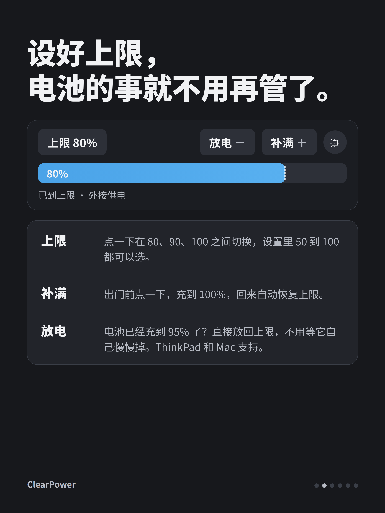
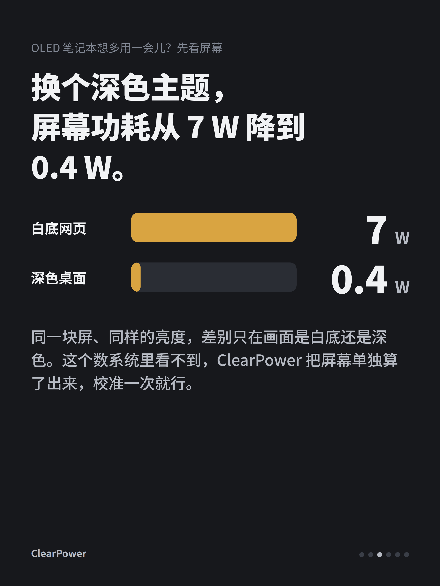
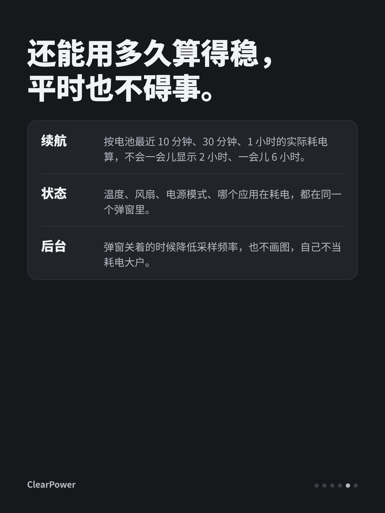

# 小红书

**标题**（20 字内）

自己写了个笔记本电池管理工具，三平台

**图片**（按顺序，1 为封面）

1. 
2. 
3. 
4. 
5. 
6. 

**正文**

一直想要一个轻量、可视化好、三个平台都能用的电源管理软件，插着电的时候帮我设住充电上限，让电池别总停在 100%，用电池的时候能看到电耗在哪、还能用多久。找了一圈没有合适的，就自己写了一个，叫 ClearPower，开源的。

插着电的时候点一下图标，上限就在 80、90、100 之间切换。出门前点一下补满，它会充到 100%，回来自动恢复上限；要是电已经充到 95% 了，也可以直接放回上限，不用等它自己慢慢掉。

用电池的时候有一张图，每一瓦去了哪一眼能看清，CPU、显卡、内存、屏幕各占多少，数字都是传感器测的，加起来就是整机。屏幕我单独校准过一次，同一块 OLED 白底网页要 7 W，深色桌面只要 0.4 W，这个差距以前完全看不到。剩余时间按最近一段时间的实际耗电来算，不会乱跳。

它很轻，弹窗关着的时候基本不干活。Linux、macOS、Windows 都有安装包，充电上限目前支持 ThinkPad 和 Apple Silicon 的 Mac，AMD 还没做。GitHub 搜 Clearailhc/ClearPower，欢迎试试，也欢迎告诉我在你的机器上准不准。

#笔记本 #电池健康 #ThinkPad #MacBook #开源 #Linux #Windows #OLED
