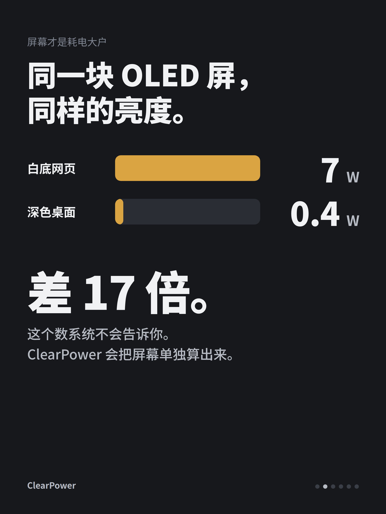
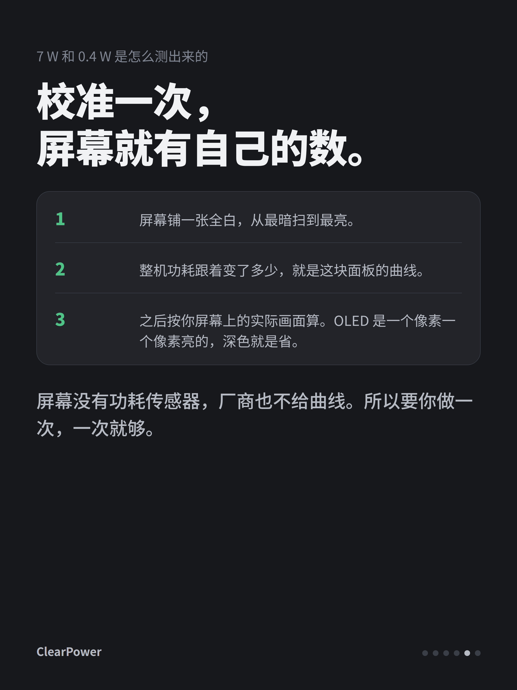

# 小红书

**标题**（20 字内）

笔记本一直插着电用？让它充到 80% 就停

**图片**（按顺序，1 为封面）

1. 
2. 
3. 
4. 
5. 
6. 

**正文**

笔记本一直插着电，电量常年 100%，电池就是这么老掉的。

ClearPower 让它充到 80% 就停。要出门，点一下补满，回来自动恢复。Linux、Mac、Windows 都有，免费开源。

顺便它还画了张图，每一瓦去了哪一眼看清：CPU、显卡、内存、屏幕各吃多少。不是估的，加起来正好是整机。

最意外的是屏幕。同一块 OLED、同样亮度，白底网页 7 W，深色桌面 0.4 W，差 17 倍。这个数系统不会告诉你。

支持范围看最后一张图。GitHub 搜 Clearailhc/ClearPower。

#笔记本 #电池健康 #ThinkPad #MacBook #开源 #Linux #Windows #OLED
