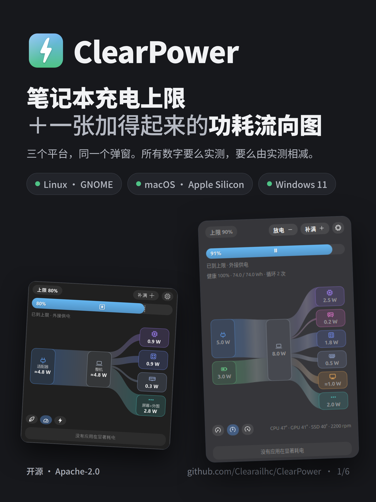
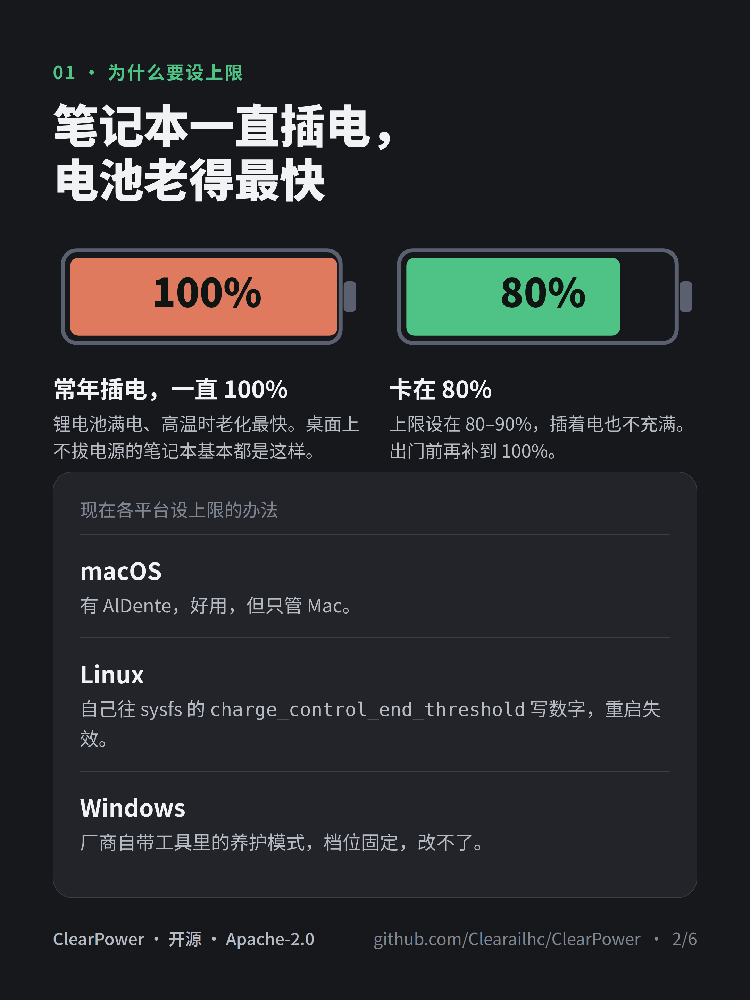
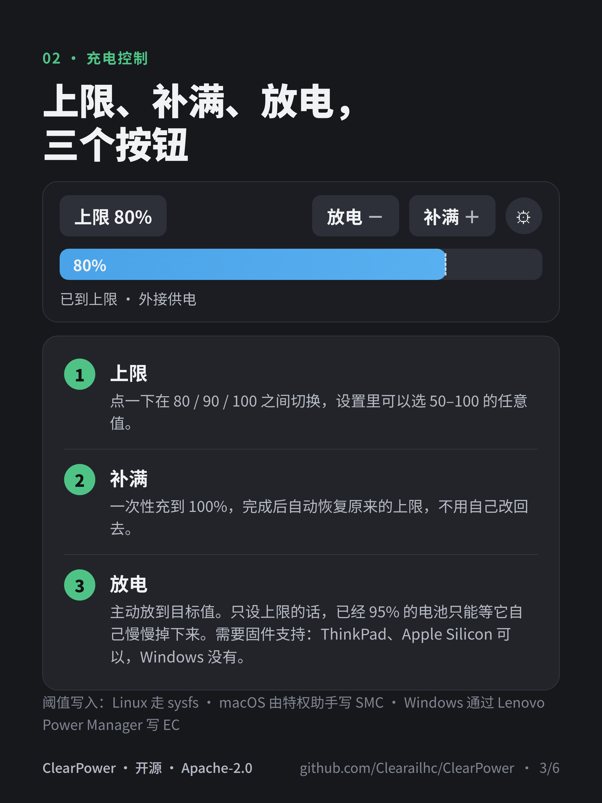
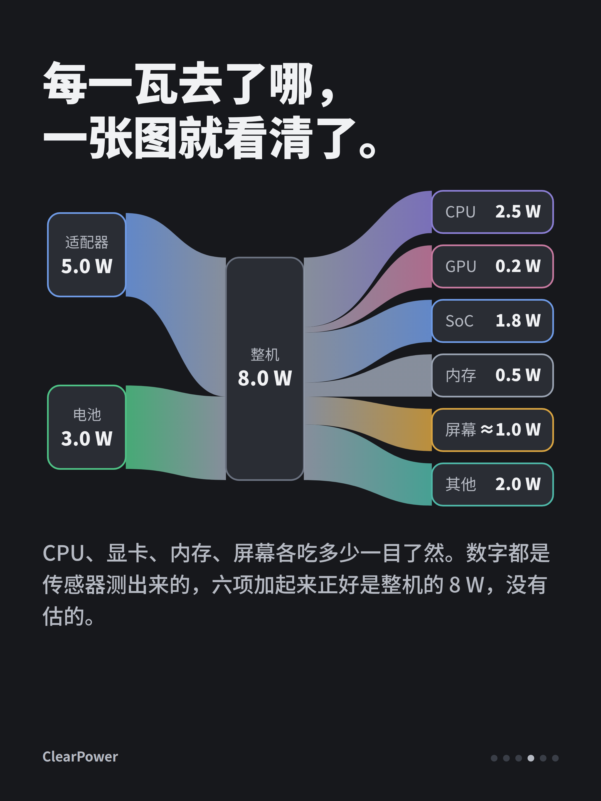
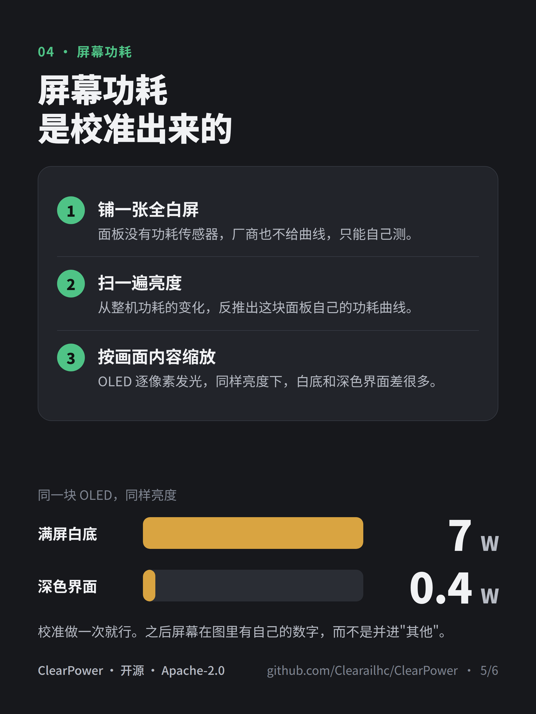
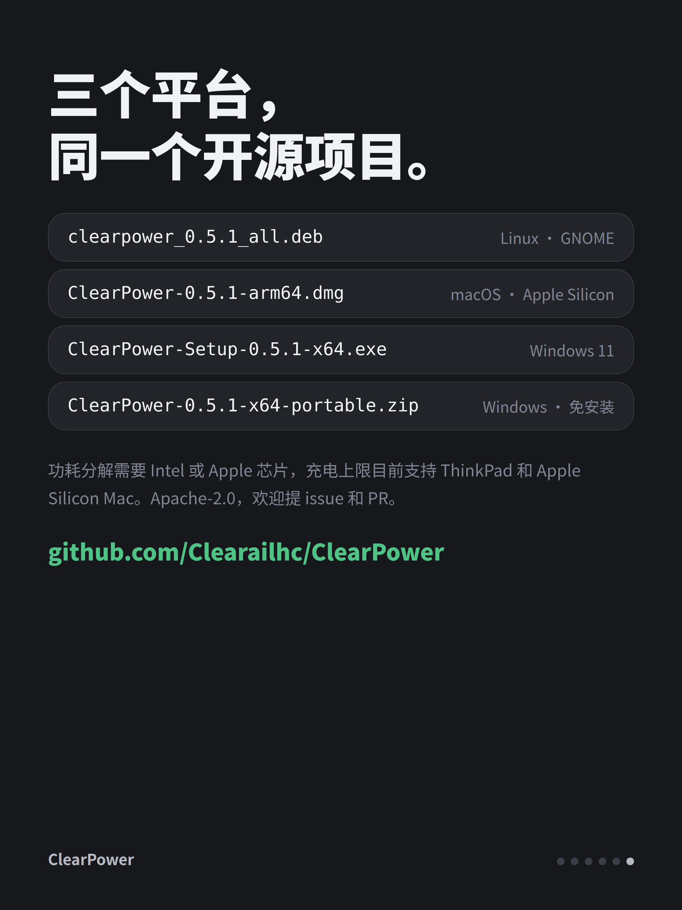

# ClearPower：把笔记本电池卡在 80%，顺便看清每一瓦去了哪

笔记本长期插电，电池一直停在 100%，是锂电池老化最快的用法。要避免就得设充电上限。Mac 上有 AlDente；Linux 上得自己往 sysfs 写数字，重启失效；Windows 上一般只有厂商自带的养护模式，档位固定。

ClearPower 把充电上限做成了三个平台通用的托盘/菜单栏程序，另外还画了一张功耗流向图，能看到每一瓦分别去了 CPU、GPU、屏幕还是别的地方。

## 充电上限

点一下图标，在 80 / 90 / 100 之间切换；设置里可以选 50–100 的任意值。

另外两个按钮：**补满**，一次性充到 100%，完成后自动恢复原来的上限；**放电**，主动放到目标值——只设上限的话，已经充到 95% 的电池会停在那儿等自然掉电，很久下不来。放电需要固件支持，目前 ThinkPad 和 Apple Silicon 可以，Windows 上没有。

阈值写入三个平台各走各的：Linux 写 sysfs 的 `charge_control_*_threshold`；macOS 由一个小的特权助手写 SMC 键，安装时输一次管理员密码；Windows 通过联想 Power Manager 自己的接口写进 EC，不装驱动，不要管理员权限。

## 功耗流向图

系统自带和第三方工具的功耗信息，要么只有进程级、看不到屏幕和内存这些硬件，要么数字是模型估的，各项加起来跟总数对不上。

ClearPower 显示的每个数，要么是传感器实测，要么是实测值相减，不建模。

弹窗里是一条流：适配器/电池 → 整机 → CPU / GPU / SoC / 内存 / 屏幕 / 其他。芯片各项来自 Intel RAPL，macOS 上是 Apple 的能量计数器；整机在用电池时直接读电池电量计；没有独立传感器的 SSD、Wi-Fi、USB 等，用整机减去所有已知项，归到"其他"。左右两边永远配平。

屏幕单独处理。面板没有功耗传感器，厂商也不给曲线，所以要做一次校准：显示全白屏、扫一遍亮度，从整机功耗的变化反推出这块面板的曲线，之后按画面内容缩放，因为 OLED 逐像素发光。同一块 OLED，满屏白底约 7 W，深色界面约 0.4 W。

同一个弹窗里还有：续航估计（按电量计在 10 分钟 / 30 分钟 / 1 小时窗口内的实际变化算，比系统的瞬时估计稳定）、电源模式切换、温度和风扇、当前耗电明显的应用。中英文界面，跟随系统深浅色。

弹窗关着的时候它基本不干活：降低采样频率，不画图，温度和进程列表要看了才查。

## 硬件支持

- 完整功耗分解：Intel RAPL 或 Apple Silicon，AMD 的 RAPL 还没做
- 充电上限：ThinkPad 及其他有内核阈值接口的品牌、全部 Apple Silicon Mac
- Windows 接电源时整机功耗是估算值，标 ≈；Windows 不提供整机功耗传感器，只有用电池时电量计的数才准

0.5.1 已发布，deb、dmg、Windows 安装包和便携版一起，附 SHA256SUMS，Apache-2.0：

https://github.com/Clearailhc/ClearPower/releases/latest

AMD RAPL、其他品牌的充电接口、其他桌面环境的前端，欢迎提 issue 和 PR。
